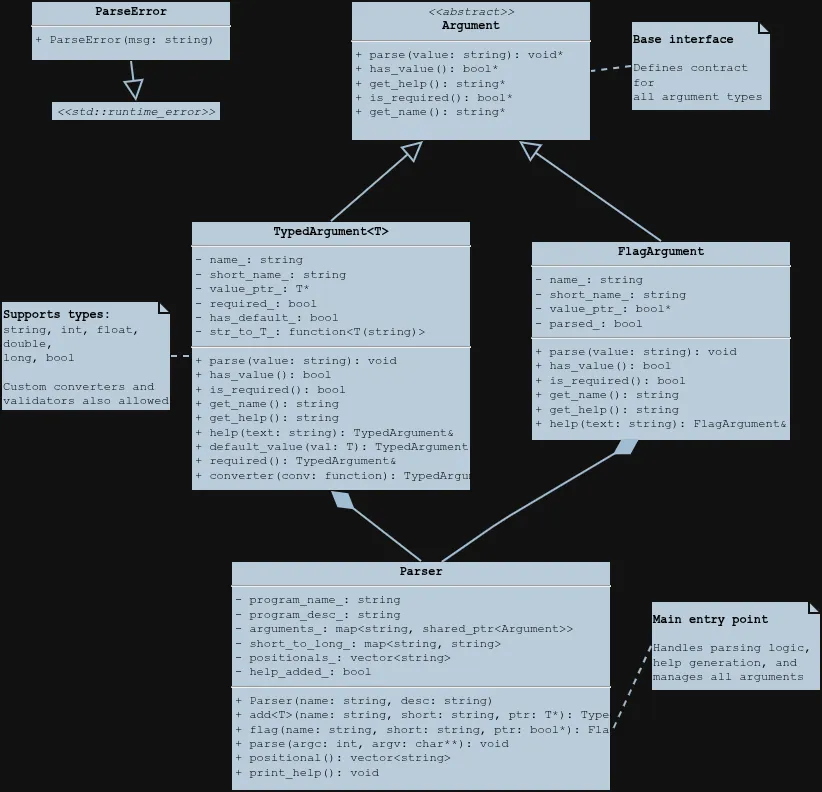

<div align="center">

# Incanti


---

**Incanti** – A single-header C++ library for simple and elegant command line argument parsing.

</div>

Just as a sorcerer meticulously prepares incantations to manifest a spell, **Incanti** helps you structure the commands that bring your software to life. It transforms the chaotic ritual of `argc` and `argv` into a clean, expressive declaration of intent. Simply drop in `incanti.hpp`, define your options, and let Incanti handle the rest without any external dependencies.

## Features

- Single header, no dependencies
- Type-safe argument parsing (strings, numbers, booleans, etc.)
- Short (`-v`) and long (`--verbose`) option support
- Required and optional arguments with default values
- Custom converters and validators
- Automatic help generation
- Positional argument handling
- Combined short flags (`-vdf`)

## Operator Style (Recommended)

Incanti provides an operator-based syntax that's clean, expressive, and feels like natural C++:

```cpp
parser >> arg("file", "f", &filename) 
      | required 
      | "Input file path";

parser >> arg("threads", "t", &threads)
      | "Number of worker threads"
      | def(4);

parser >> flag("verbose", "v", &verbose)
      | "Enable verbose output";
```

## Install

1. Using wget
```bash
wget https://github.com/Aliqyan-21/incanti/raw/main/include/incanti.hpp
```

2. Using curl
```bash
curl -L https://raw.githubusercontent.com/Aliqyan-21/incanti/main/include/incanti.hpp -o incanti.hpp
```

> will be installed as `incanti.hpp` in the folder you are currently in

## Quick Start

> Use any style u want, it's magic anyways!

```cpp
#include "incanti.hpp"

int main(int argc, char *argv[]) {
    Incanti::Parser parser("program", "program to test incanti");

    std::string input;
    int threads = 4;
    bool verbose = false;

    /* you can any way to use Incanti */

    // Method 1: normal fluent interface
    parser.add("input", "i", &input)
        .help("Input file path")
        .required();

    parser.add("threads", "t", &threads)
        .help("Number of threads")
        .default_value(4);

    parser.flag("verbose", "v", &verbose)
        .help("Enable verbose output");

    // Method 2: operator style (clean and expressive, magical)
    parser >> arg("input", "i", &input)
          | required
          | "Input file path";

    parser >> arg("threads", "t", &threads)
          | "Number of threads"
          | def(4);

    parser >> flag("verbose", "v", &verbose)
          | "Enable verbose output";

    try {
        parser.parse(argc, argv);

        // Your application logic here
        std::cout << "Processing " << input
                  << " with " << threads << " threads\n";

    } catch (const Incanti::ParseError &e) {
        std::cerr << "Error: " << e.what() << "\n";
        parser.print_help();
        return 1;
    }

    return 0;
}
```

Run with:
```bash
./myapp --input data.txt --threads 8 -v
./myapp -i data.txt -t 8 -v
./myapp -i data.txt -vt8  # the vanilla combined flags with attached value
```

## Architecture

Incanti follows a clean object-oriented design with polymorphic argument handling:

<div align="center">



</div>

**Key Components:**

- **`Argument`** – Abstract base class defining the interface for all argument types
- **`TypedArgument<T>`** – Template class handling typed arguments (string, int, float, double, long, bool) with optional custom converters and validators
- **`FlagArgument`** – Specialized class for boolean flags that don't require values
- **`Parser`** – Main orchestrator that manages argument registration, parsing, and help generation
- **`ParseError`** – Exception class for parsing errors

The design allows for easy extension: add new argument types by inheriting from `Argument`, or customize existing types with converters and validators.

## Supported Types

Out of the box, Incanti supports:

- `std::string` – Text values
- `int` – Integer numbers
- `float` – Single-precision floating point
- `double` – Double-precision floating point
- `long` – Long integers
- `bool` – Boolean flags (with "true/false", "1/0", "yes/no")

## Usage Docs

> [**Click here for Docs**](docs.md)

## Design Philosophy

Incanti embodies a few key principles:

**Simplicity** – Single header, zero dependencies, minimal API interface.

**Type Safety** – Leverage C++ templates for compile-time and runtime type checking.

**Fluency** – Chain methods to build expressive argument definitions.

**Extensibility** – Easy to add custom converters, validators, or new argument types.

This library was crafted as a personal project to explore modern C++ design patterns and to create something genuinely useful for CLI applications.

> It's not trying to be everything to everyone – just a clean, elegant solution for argument parsing.

## Status

**Work in Progress** – The API is stable for basic usage, but expect refinements and new features.

## License

[apache 2.0](license.md)

<div align="center">

*Transform your command line chaos into elegant incantations*

</div>
